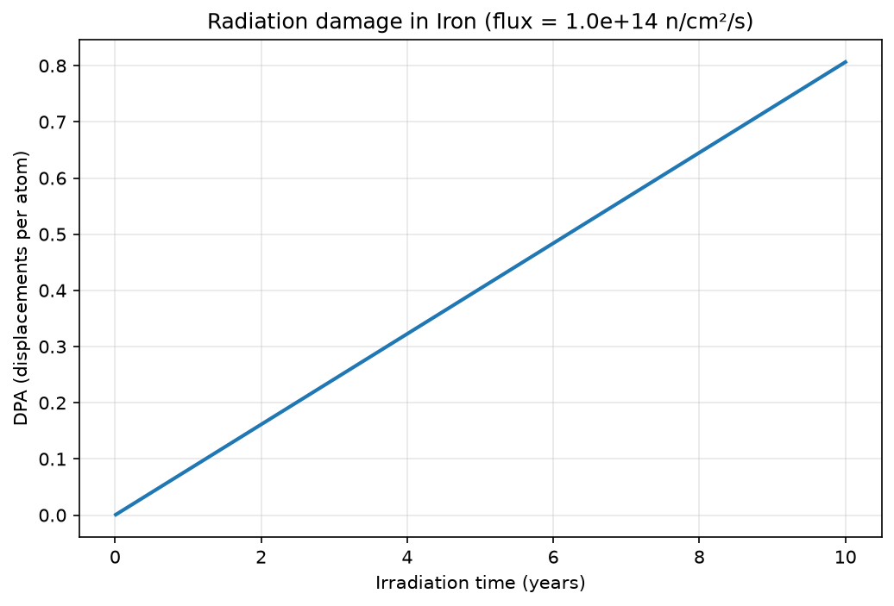
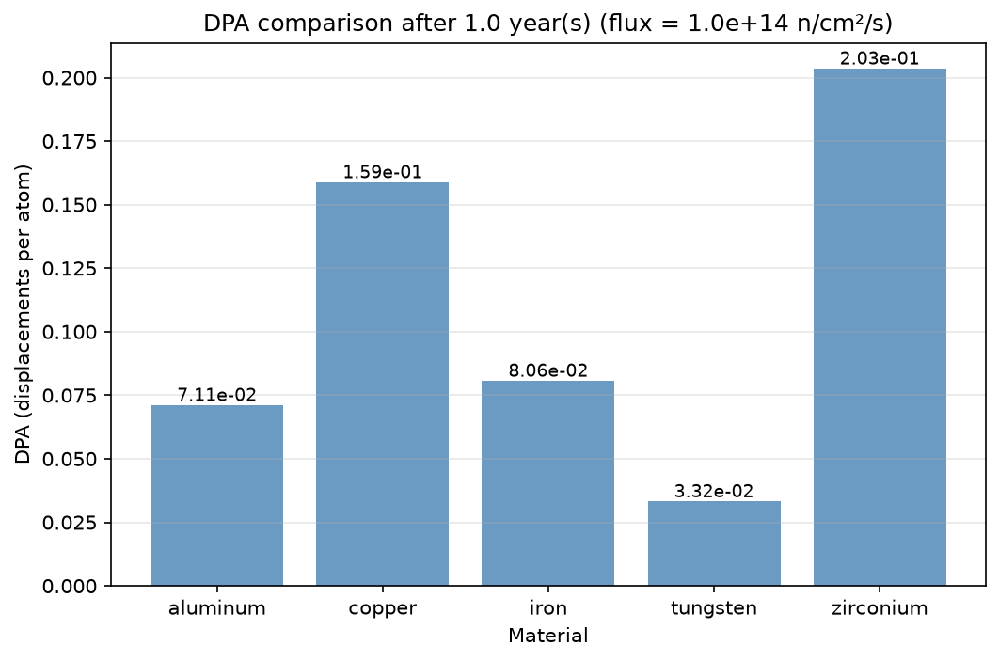

# NRTDamage


A Python library and command-line tool to estimate radiation-induced
atomic displacement damage in nuclear materials using the
**NRT (Norgett-Robinson-Torrens) model**.

## What is NRTDamage?

When a neutron strikes an atom in a material, it can displace that atom
from its lattice position, creating a cascade of further displacements.
This phenomenon, known as **radiation damage**, is critical for predicting
the lifetime of materials in nuclear reactors and space applications.

NRTDamage implements the standard NRT model to estimate the number of
**displacements per atom (DPA)**, the key metric used by nuclear engineers
worldwide to quantify radiation damage.

## Example output




## Installation

```bash
git clone https://github.com/AniaOuiddir/NRTDamage.git
cd NRTDamage
pip install -e .
```

## Usage

### Compute DPA for a material

```bash
nrtdamage compute --material iron --flux 1e14 --time 3.15e7
```

### List available materials

```bash
nrtdamage list
```

### Available materials

| Material   | Symbol | Displacement Energy (eV) |
|------------|--------|--------------------------|
| iron       | Fe     | 40.0                     |
| zirconium  | Zr     | 40.0                     |
| tungsten   | W      | 90.0                     |
| aluminum   | Al     | 25.0                     |
| copper     | Cu     | 30.0                     |
| nickel     | Ni     | 40.0                     |
| molybdenum | Mo     | 60.0                     |
| vanadium   | V      | 40.0                     |

## Use as a Python library

```python
from nrtdamage.physics import compute_dpa
from nrtdamage.materials import get_material

mat = get_material("iron")
dpa = compute_dpa(
    flux=1e14,
    cross_section=mat["cross_section"],
    damage_energy=1000.0,
    displacement_energy=mat["displacement_energy"],
    time=3.15e7,
)
print(f"DPA: {dpa:.4e}")
```

## Running the tests

```bash
python -m pytest tests/ -v
```

## Physical background

The NRT model estimates the number of displaced atoms as:N_dpa = 0.8 * T_dam / (2 * E_d) Where:
- `T_dam` is the damage energy in eV
- `E_d` is the threshold displacement energy of the material in eV
- `0.8` is an empirical efficiency factor

## Reference

Norgett, M.J., Robinson, M.T., Torrens, I.M. (1975).
*A proposed method of calculating displacement dose rates.*
Nuclear Engineering and Design, 33(1), 50-54.

## License

MIT License - see [LICENSE](LICENSE) for details.
